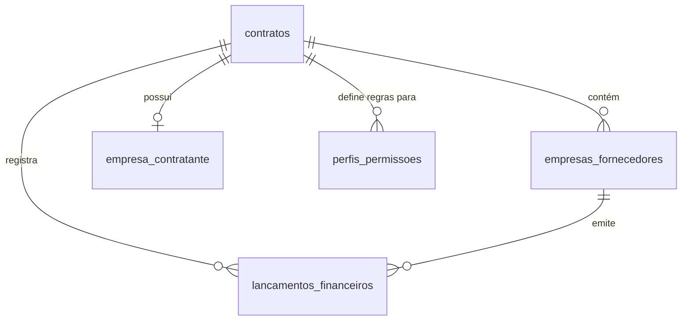

# Especificação Completa do Sistema - Gestor de Obras

Este documento consolida a especificação técnica e funcional completa da plataforma **Gestor de Obras** na revisão atual. A plataforma é uma solução SaaS Multi-Tenant focada na gestão integrada de obras, infraestrutura, fornecedores, faturamentos (DRE) e contratos viários.

---

## 1. Arquitetura do Sistema e Estratégia SaaS Multi-Tenant

O sistema adota um modelo descentralizado de responsabilidades entre um **Container de Identidade (IdP)** e um **Sistema de Negócio Proprietário (Cerne)**.

### 1.1. Camada de Autenticação (AuthN)
- **Provedor de Identidade (IdP - Firebase Auth)**: Responsável exclusivamente por validar a identidade do usuário (e-mail/senha, OAuth SSO da Google/Microsoft e Duplo Fator de Autenticação - MFA).
- **Custom Claims JWT**: O Firebase Auth injeta no token assinado do usuário as claims de identidade básicas estruturadas:
  - `user_id`: Identificador exclusivo da conta.
  - `contrato_id`: Identificador do tenant contratante principal (ex: `CTR-2026-SYS`).
  - `empresa_id` / `entidade_id`: Vínculo a uma empresa/fornecedor (ex: `SUP-9823-STORAGE`).
  - `perfil`: Papel de navegação básica (`ADMIN`, `GESTOR`, `FINANCEIRO`, `FORNECEDOR`).
  - `mfa_verified`: Flag indicando validação de duplo fator.

### 1.2. Camada de Autorização (AuthZ - Cerne)
- **Base Proprietária (PostgreSQL / Supabase)**: Assume 100% da responsabilidade sobre regras de negócio e autorização de operações CRUD.
- **Validação de Token Stateless**: O backend (Express) intercepta os requests no middleware, decodifica o token Firebase usando criptografia assimétrica (chaves públicas JWKS em memória) e injeta o `contrato_id` (tenant) nas variáveis do cabeçalho da requisição. Nenhuma chamada HTTP (round-trip) ao Firebase é feita por requisição.
- **Segurança de Acesso (Row-Level Security - RLS)**: O isolamento multitenant de dados é forçado a nível de banco de dados. O Supabase utiliza a variável `app.current_contrato_id` obtida do token verificado para restringir queries e mutações de tabelas transacionais de forma automática e segura.
- **Zero Trust**: Nenhuma informação de identificação (como `contrato_id` ou `empresa_id`) é extraída do body ou query string para autorizar operações de escrita/leitura.

---

## 2. Fluxo de Autenticação e Perfis de Usuários

O sistema possui uma matriz granular de controle de acesso (RBAC) definida localmente na tabela `perfis_permissoes` do PostgreSQL, mapeada com base no papel (`perfil`) autenticado no IdP.

### 2.1. Classificação de Perfis (Roles)
- **ADMIN**: Acesso completo e irrestrito a configurações fiscais, cadastro de fornecedores, injeção de claims e parametrização de contratos.
- **FINANCEIRO**: Permissão de leitura do DRE, faturamentos, processamento de notas fiscais e escrita/liquidação de lançamentos, sem acesso à gestão de claims.
- **GESTOR**: Acompanhamento físico-financeiro de trechos viários, visualização do DRE consolidado e aprovação de medições contratuais.
- **FORNECEDOR**: Acesso limitado exclusivamente aos dados do seu próprio `empresa_id` (filtro estrito), visualizando apenas suas medições, alertas e notas sob faturamento.

---

## 3. Estrutura do Banco de Dados

A infraestrutura e o negócio são divididos entre o Firestore (dados de onboarding, invites globais e estatísticas) e o PostgreSQL (negócio transacional).

### 3.1. Dicionário de Tabelas / Coleções

#### Tabela `empresa_contratante` (PostgreSQL / Supabase)
Cadastro das entidades contratantes detentoras do tenant principal.
- `contrato_id` (VARCHAR, PK): Token/código de identificação do contrato master do tenant.
- `nome` (VARCHAR): Razão social ou nome da contratante.
- `natureza` (VARCHAR): Natureza da entidade ('Publica' ou 'Privada').
- `cnpj` (VARCHAR): Cadastro Nacional de Pessoa Jurídica da contratante.
- `email` / `telefone` (VARCHAR): Contatos institucionais.
- `gestorresponsavel` (VARCHAR): Nome do responsável principal pelo contrato.
- `unidadeadministrativa` (VARCHAR): Divisão administrativa correspondente.

#### Tabela `empresas_fornecedores` (PostgreSQL / Supabase)
Empresas homologadas, fornecedores ou subempreiteiras do ecossistema.
- `id` (VARCHAR, PK): Identificador único da empresa fornecedora.
- `contrato_id` (VARCHAR, PK, FK -> `empresa_contratante.contrato_id`): Isolamento multitenant.
- `nome` (VARCHAR): Nome empresarial ou fantasia.
- `cnpj_cpf` (VARCHAR): CNPJ ou CPF do fornecedor.
- `tipo` (VARCHAR): Categoria da empresa (`FORNECEDOR`, `CLIENTE`, `PARCEIRO`, `CONTRATANTE`).
- `emailcontato` / `telefone` (VARCHAR): Dados do ponto de contato do fornecedor.
- `status` (VARCHAR): Estado de homologação (`ATIVO`, `BLOQUEADO`, `EM_ANALISE`).
- `totalfaturado` (NUMERIC): Valor monetário acumulado em medições aprovadas.

#### Tabela `lancamentos_financeiros` (PostgreSQL / Supabase)
Controle transacional de receitas e despesas vinculadas a contratos de obras.
- `id` (VARCHAR, PK): ID único do lançamento.
- `contrato_id` (VARCHAR, FK): Associação ao tenant.
- `fornecedor_id` (VARCHAR, FK): Associação à empresa emitente.
- `descricao` (VARCHAR): Histórico ou descrição do faturamento.
- `valor` (NUMERIC): Valor do lançamento.
- `tipo` (VARCHAR): Tipo do faturamento (`RECEITA`, `DESPESA`).
- `status` (VARCHAR): Estado do faturamento (`PAGO`, `PENDENTE`, `EM_PROCESSAMENTO`).
- `data_vencimento` (DATE): Data limite de pagamento.
- `criado_por` (VARCHAR): E-mail do operador que efetuou a entrada.

#### Tabela `perfis_permissoes` (PostgreSQL / Supabase)
Matriz relacional de autorização granular.
- `contrato_id` (VARCHAR, PK): Tenant aplicável.
- `perfil` (VARCHAR, PK): Papel associado (`ADMIN`, `GESTOR`, `FINANCEIRO`, `FORNECEDOR`).
- `pode_ver_dre` (BOOLEAN): Acesso ao painel financeiro consolidado.
- `pode_editar_pagamento` (BOOLEAN): Habilidade de cadastrar ou liquidar parcelas.
- `pode_aprovar_medicao` (BOOLEAN): Permissão para aceitar boletins de trechos concluídos.
- `pode_cadastrar_empresa` (BOOLEAN): Homologação de novos parceiros.
- `pode_exportar_relatorio` (BOOLEAN): Acesso para downloads de DRE/Faturamento.
- `pode_gerenciar_usuarios` (BOOLEAN): Gestão de acessos locais de operadores.

---

## 4. Módulos Funcionais e Telas Principais

### 4.1. Dashboard Principal
Exibição gráfica e intuitiva sobre o andamento dos projetos e faturamentos. Apresenta o pipeline de contratos ativos, alertas urgentes de prazos, totalizadores de receitas/despesas gerais e listagem das últimas atividades ocorridas no tenant.

### 4.2. DRE Financeiro (`FinanceiroView`)
Módulo de acompanhamento contábil estruturado em contas de resultado (Receita Operacional Bruta, Deduções, Custos Variáveis, EBITDA, Margens e Lucro Líquido). Integra geração de insights automáticos via **Gemini AI** (`gemini-2.5-flash`) calibrando sugestões de margens e negociações com fornecedores.

### 4.3. Cronograma Viário (`CronogramaFluxoTimeline`)
Linha do tempo interativa e física-financeira de trechos viários e obras em andamento. Detalha cronograma planejado versus executado, marcos de conclusão de trechos físico-geográficos e desembolsos previstos indexados por fornecedor.

### 4.4. Homologação de Empresas (`EmpresasView`)
Central de controle B2B para homologação, checagem cadastral, e auditoria documental de fornecedores e parceiros da cadeia produtiva.

### 4.5. Matriz de Acessos (`MatrizAcessosView`)
Painel interativo que renderiza a matriz `perfis_permissoes` do banco PostgreSQL do tenant, permitindo a usuários `ADMIN` customizar as flags de autorização RBAC aplicadas a cada classe de perfil diretamente na UI.
